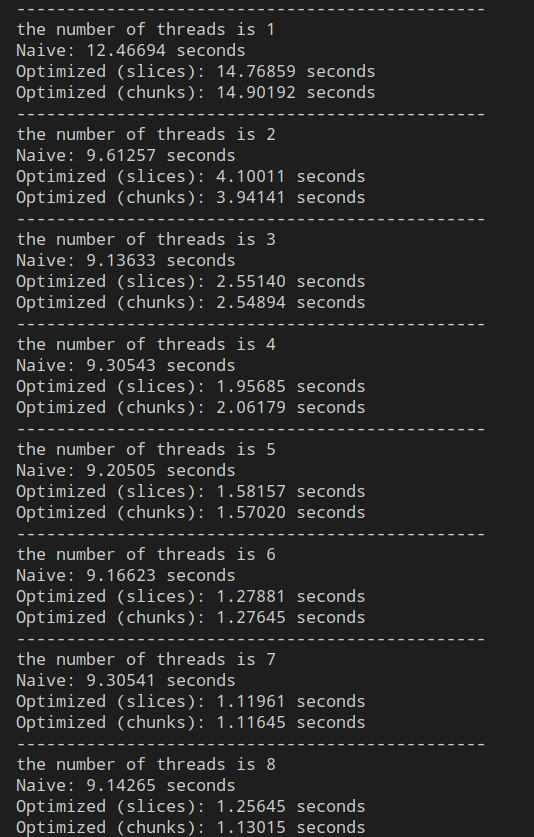

## Exercise 1 - OpenMP Hello World
    gcc -fopenmp -Wall -Wextra -std=gnu99 hello.c -o hello
    ./hello

tid not numerical order:
All child processes have the same priority
depend on previous.
(tid = 0, master thread)

## Exercise 2 - Matrix Multiplication
    gcc -fopenmp -Wall -Wextra -std=gnu99 matmul.c -o matmul
    ./matmul

**To be done**
(单线程pragma负提升?)
Describe the performance differences between the methods you implemented and try to analyze the reason(Run more times to find a common pattern instead of just running once).

Explain why using OpenMP may not necessarily lead to optimal performance on a single compute node with multiple cores.

Bonus: Implement an additional optimization and discuss its impact on performance.

## Exercise 3 - Dot Product
    gcc -fopenmp -Wall -Wextra -std=gnu99 dotp.c -o dotp
    ./dotp